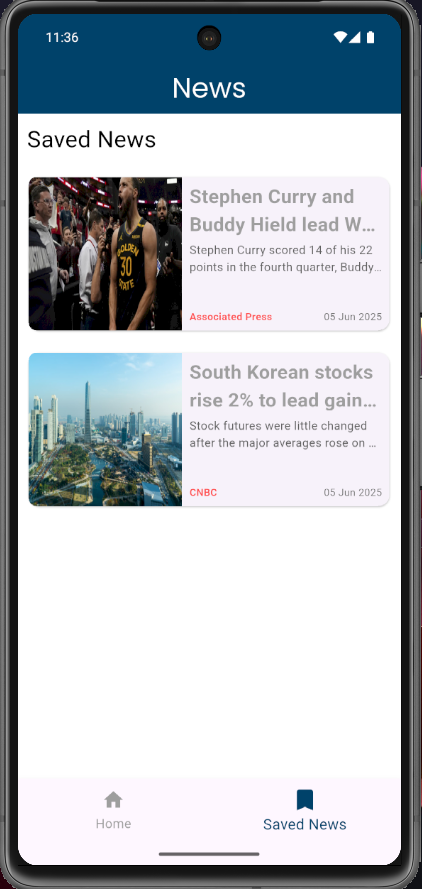

# 📰 News App

A feature-rich News Application built using **Flutter**, following **Clean Architecture**. The app fetches news from a remote API, supports dynamic category browsing, bookmarking of articles, and offline access using `sqflite`. It is optimized for both physical devices and emulators.

## 🚀 Features

- 🔄 Fetch latest news across various categories like Business, Sports, Health, etc.
- 🧭 Uses `GoRouter` for advanced navigation with route-based state handling.
- 🔖 Bookmark articles and view them later (even offline).
- 📶 Splash screen detects internet connectivity and redirects accordingly.
- 📱 Responsive and smooth UI with category tabs and bottom navigation bar.
- 🧱 Follows Clean Architecture with separation between Data, Domain, and Presentation layers.
- 💾 Local storage support using `sqflite`.

## 🛠️ Tech Stack

- **Flutter** (UI & Logic)
- **Provider** (State Management)
- **GoRouter** (Navigation)
- **Dio** (API Requests)
- **sqflite** (Local Storage)
- **Clean Architecture** (Codebase structure)

## 📸 Screenshots

| Splash Screen            | Home Screen              | Detailed News            | Bookmarked News          |
| ------------------------ | ------------------------ | ------------------------ | ------------------------ |
|  |  |  |  |

## 🔧 Installation

1. **Clone the repository:**
   ```bash
   git clone https://github.com/Keshav-Var/news_app.git
   cd news_app
   ```
2. **Install dependencies:**
   ```bash
   flutter pub get
   ```
3. **Run App:**
   ```bash
   flutter run
   ```
